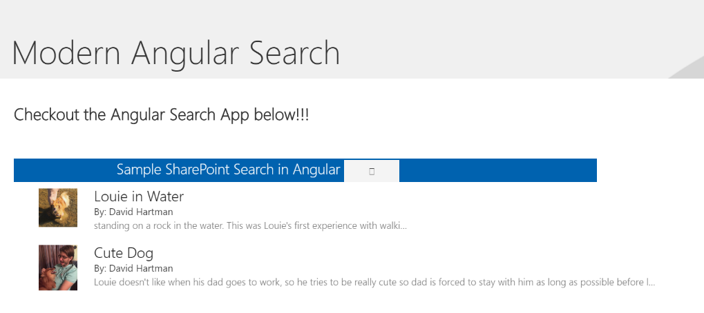

# Search Client-Side Web Part Built with Angular v1.x

## Summary
Sample Search Web Part that illustrates how you can use Angular within the new SharePoint Framework

This app uses SharePoint's Search REST API endpoint to query listitems of a specific content type and displays the results to the end user.
Ideally instead of selecting a content type for the search you would want to select a Result Source, but currently Result Sources are not
through SharePoint's REST API.

The logic for querying the SharePoint Content Types in the properties of the webpart was in part due to Chris O'Brien and this [blog post](http://www.sharepointnutsandbolts.com/2016/09/sharepoint-framework-spfx-web-part-properties-dynamic-dropdown.html?m=0)

> Note: In order to use the ngOfficeFabric code I use the ModuleLoader to load newer source files than the currently
> Office Fabric UI in SharePoint Online, which will cause many of the icons not to load properly on the SharePoint
> Page this webpart is added to.

## Applies to

* [SharePoint Framework Developer Preview](http://dev.office.com/sharepoint/docs/spfx/sharepoint-framework-overview)
* [Office 365 developer tenant](http://dev.office.com/sharepoint/docs/spfx/set-up-your-developer-tenant)

## Solution

Solution|Author(s)
--------|---------
angular-search|David Hartman ([Slalom](https://slalom.com))

## Version history

Version|Date|Comments
-------|----|--------
1.0|October 14, 2016|Initial release

## Disclaimer
**THIS CODE IS PROVIDED *AS IS* WITHOUT WARRANTY OF ANY KIND, EITHER EXPRESS OR IMPLIED, INCLUDING ANY IMPLIED WARRANTIES OF FITNESS FOR A PARTICULAR PURPOSE, MERCHANTABILITY, OR NON-INFRINGEMENT.**

---

## Configuration Bliss

- clone this repo
- in the command line run:
 - `npm i typings -g`
 - `npm i`
 - `gulp serve --nobrowser`
- Enable the following features in you site
 - Publishing features on site collection
 - Publishing features on site

> Note: The Content Types that I pull for the search come from the Publishing Content Type which only
> available when the Publishing Features are enabled on the site.

- In the file 'AngularSearchWebPart.ts' around line 92 you will need to put the url of the directory where the html template file resides.

> Note: Adding the location of the template is necessary because Angular's $sce doesn't trust the location taht the
> html template is loaded from, so the url needs to be whitelisted with the $sce service. If you just want whitelisted
> every url the entry in the $sce could just be '*'. There is plenty of documentation available if you run into trouble
> whitelisting the template url.

