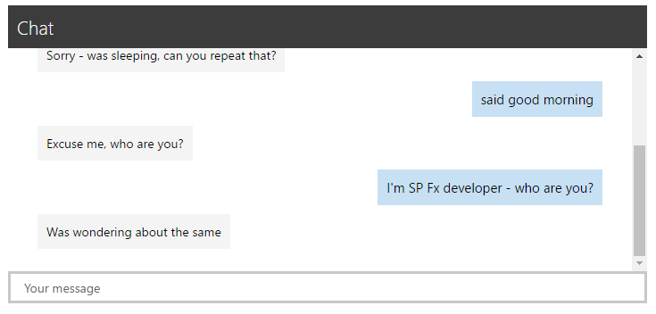
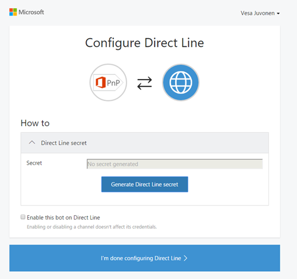

# Microsoft Bot Framework Web Chat

## Summary
A web part that acts as a web chat component for bot's built on the Microsoft Bot Framework using the Direct Line API. When sending messages
the web part uses the username of the currently logged in user. The web part has settings for color for branding purposes.

You can see this web part sample, including a sample VS 2015 bot application in practice from [PnP SPFx Special Interest Group recording](https://youtu.be/Tv03CU_PmVs?t=1329)
where sample was demonstrated.

## Used SharePoint Framework Version 

## Applies to

* [SharePoint Framework Developer Preview](http://dev.office.com/sharepoint/docs/spfx/sharepoint-framework-overview)
* [Office 365 developer tenant](http://dev.office.com/sharepoint/docs/spfx/set-up-your-developer-tenant)
* [Microsoft Bot Framework](http://dev.botframework.com)

## Prerequisites

> You need to have a bot created and registered using the Microsoft Bot Framework and registered to use the Direct Line Channel,
which will give you the secret needed when adding this web part to the page.  For more information on creating a bot and registering
the channel you can see the official web site at [dev.botframework.com](http://dev.botframework.com), as well as various tutorials
over at [www.garypretty.co.uk/category/microsoft-bot-framework/](http://www.garypretty.co.uk/category/microsoft-bot-framework/)

See more details on how to create a bot from following locations.

* [Getting started with the Connector](https://docs.botframework.com/en-us/csharp/builder/sdkreference/gettingstarted.html) - MS Bot Framework documentation
* [Creating your first bot with the Microsoft Bot Framework – Part 1 – Build and test locally](http://www.garypretty.co.uk/2016/07/14/creating-your-first-bot-with-the-microsoft-bot-framework-part-1/) - [@GaryPretty](https://twitter.com/GaryPretty)
* [Creating your first bot with the Microsoft Bot Framework – Part 2 – publishing and chatting through Skype](http://www.garypretty.co.uk/2016/07/16/creating-your-first-bot-with-the-microsoft-bot-framework-part-2/) - [@GaryPretty](https://twitter.com/GaryPretty)

> Notice that you can find simplistic bot implemented with Visual Studio 2015 using the bot templates (Oct 2016)
under the [vs2015-bot-application](./vs2015-bot-application) folder. This is simplistic bot based on above blog posts, which responses random string back.

## Solution

Solution|Author(s)
--------|---------
bot-framework | Gary Pretty ([@garypretty](http://www.twitter.com/garypretty), [garypretty.co.uk](www.garypretty.co.uk))

## Version history

Version|Date|Comments
-------|----|--------
1.0|October 11th, 2016|Initial release

## Disclaimer
**THIS CODE IS PROVIDED *AS IS* WITHOUT WARRANTY OF ANY KIND, EITHER EXPRESS OR IMPLIED, INCLUDING ANY IMPLIED WARRANTIES OF FITNESS FOR A PARTICULAR PURPOSE, MERCHANTABILITY, OR NON-INFRINGEMENT.**

---

## Minimal Path to Awesome

- Clone this repository
- in the command line run:
  - `npm install`
  - `tsd install`
  - `gulp serve`

- Register your bot in the Microsoft Bot Framework Portal, configure the Direct Line channel on the bot and obtain your Direct Line secret.

## Features
This Web Part illustrates the following concepts on top of the SharePoint Framework:

- Connecting and communicating with a bot built on the Microsoft Bot Framework using the Direct Line Channel
- Validating Property Pane Settings
- Office UI Fabric
- React

When adding the web part to a page you need to obtain your Bot Direct Line Channel secret via the [Bot Framework Portal](http://dev.botframework.com).
You then add this secret via the Property Pane of the web part. If there is an error initializing the Direct Line Client with the bot then they will
be shown in the console within the browser.

You can add Direct Line channel to bot from the bot details page under the "Add another channel" section

After this, you can click Edit for the just added Channel to get the needed secret for the client side web part.

Additional settings can be set to style the web part, including;

 - Display title of the web part
 - Web part header background color
 - Placeholder text
 - Foreground / background colors for messages, both from the user and from the bot

Currently this web part only supports plain text conversations with a bot. Other message types,
such as Rich Cards and Attachments are not supported, but are on the roadmap for a future update.

