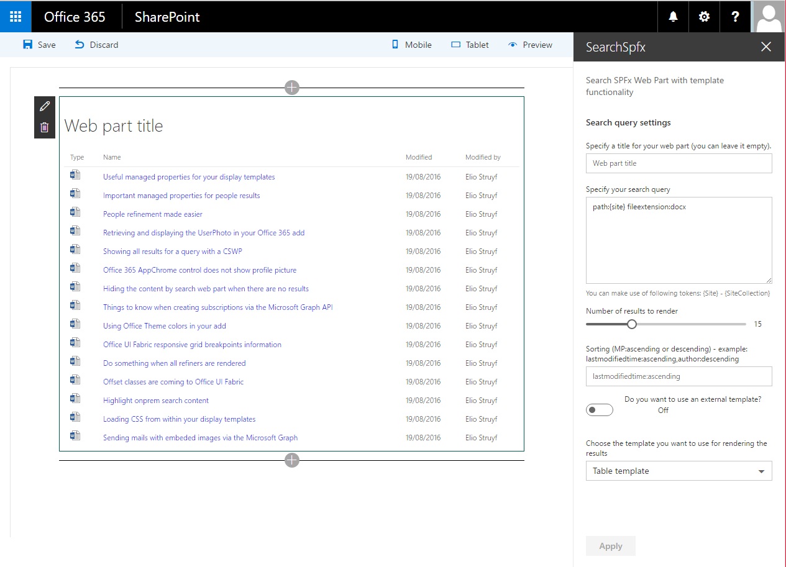
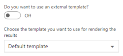

# Search Client-Side Web Part built with React and Flux

## Summary

Sample Search Web Part with internal and external template support. This sample illustrates how you can use React and Flux within the SharePoint Framework.

## Used SharePoint Framework Version 

## Applies to

* [SharePoint Framework Developer Preview](http://dev.office.com/sharepoint/docs/spfx/sharepoint-framework-overview)
* [Office 365 developer tenant](http://dev.office.com/sharepoint/docs/spfx/set-up-your-developer-tenant)

## Solution

Solution|Author(s)
--------|---------
react-search-wp|Elio Struyf (MVP, Ventigrate, [@eliostruyf](https://twitter.com/eliostruyf))

## Version history

Version|Date|Comments
-------|----|--------
0.0.4|September 08, 2016|Initial release
0.0.5|September 27, 2016|Updates for drop 4. Added the abilty to use various search tokens. Plus a logging field to watch search calls.
0.0.6|October 19, 2016|Updates for drop 5.

## Disclaimer
**THIS CODE IS PROVIDED *AS IS* WITHOUT WARRANTY OF ANY KIND, EITHER EXPRESS OR IMPLIED, INCLUDING ANY IMPLIED WARRANTIES OF FITNESS FOR A PARTICULAR PURPOSE, MERCHANTABILITY, OR NON-INFRINGEMENT.**

---

## Minimal Path to Awesome

- Clone this repo
- In the command line run:
  - `npm i`
  - `tsd install`
  - `gulp serve`
  - Open the *workbench* on your Office 365 Developer tenant
  - Test out the web part

## Features

The search web part is a sample client-side web part built on the SharePoint Framework. The web part makes use of React and the Flux pattern.

The web part has built in templating support for internal (created within the project) and external (loaded from a URL) templates.

When adding your query you are able to make use of the following tokens: {Today}, {Today+Number}, {Today-Number}, {CurrentDisplayLanguage}, {User}, {User.Name}, {User.Email}, {Site}, {SiteCollection}.

**Internal templates**

Internal templates can be found in the [templates]('./src/webparts/templates') folder. You can start building your own templates by using one of the provided samples.

**External templates**

External templates can be loaded from an URL.

If you want to test out this functionality, you can find a couple of sample templates in the [external templates]('./external_templates') folder. Upload one of these templates to your site, copy the file location and past it in the textbox.

> There is a sample project which you can use to create your own external templates. You can find it here: [Search WP SPFx Template Generator](https://github.com/estruyf/search-wp-spfx-templategenerator).

This Web Part illustrates the following concepts on top of the SharePoint Framework:

- using React and the Flux pattern with TypeScript for building SharePoint Framework Client-Side Web Parts
- loading CSS stylesheets from CDN
- using non-reactive Web Part Property Pane
- loading external templates to render
- loading scripts and stylesheets which are required in the external template (example: loading jQuery or a custom stylesheet).

