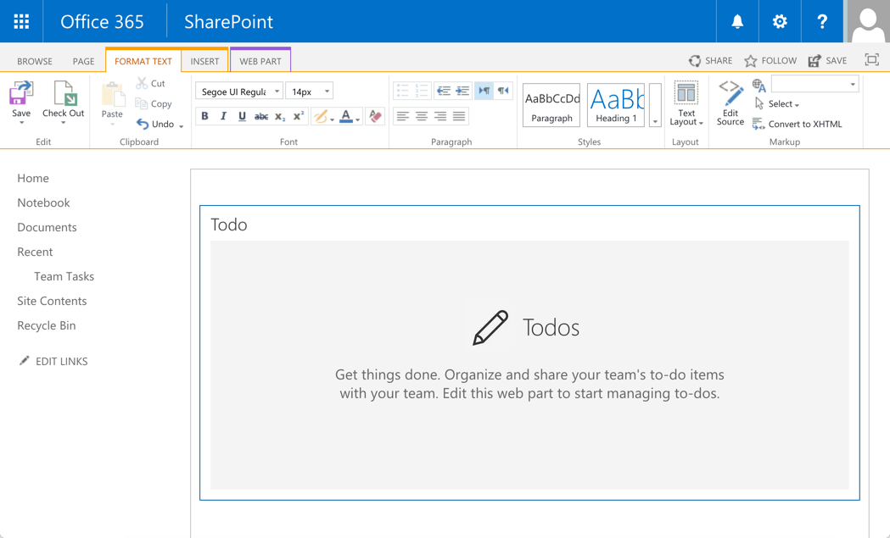
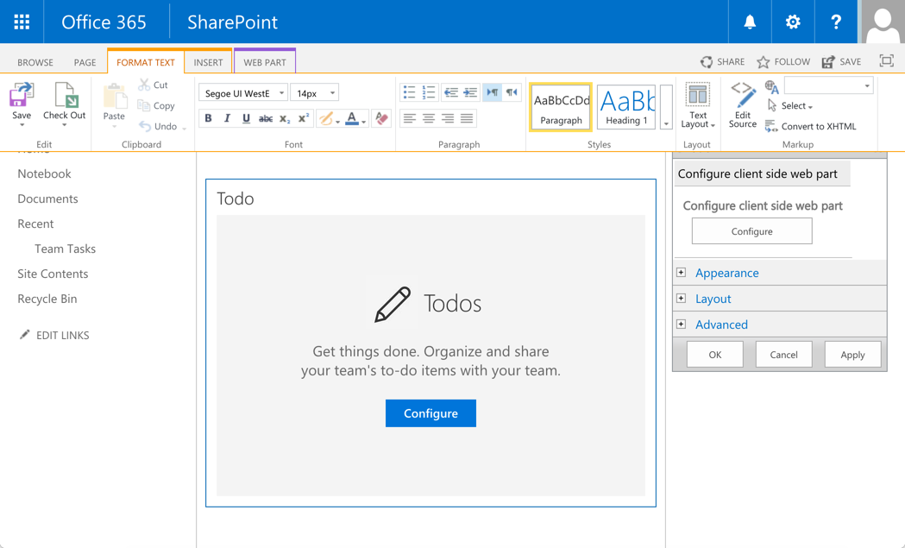

# Todo Basic Sample

## Summary
A simple todo web part built using react to showcase some of the SharePoint Framework developer features, utilities and best practices in building react based web parts.


## Applies to

* [SharePoint Framework Developer Preview](http://dev.office.com/sharepoint/docs/spfx/sharepoint-framework-overview)
* [Office 365 developer tenant](http://dev.office.com/sharepoint/docs/spfx/set-up-your-developer-tenant)

## Solution

Solution|Author(s)
--------|---------
react-todo-basic | Chakkaradeep Chandran (@chakkaradeep)

## Version history

Version|Date|Comments
-------|----|--------
1.0|October 12th, 2016|Initial release

## Disclaimer
**THIS CODE IS PROVIDED *AS IS* WITHOUT WARRANTY OF ANY KIND, EITHER EXPRESS OR IMPLIED, INCLUDING ANY IMPLIED WARRANTIES OF FITNESS FOR A PARTICULAR PURPOSE, MERCHANTABILITY, OR NON-INFRINGEMENT.**

---

## Minimal Path to Awesome

- Clone this repository
- in the command line run:
  - `npm install`
  - `gulp serve`

## Features
This todo basic sample web part showcases some of the SharePoint Framework developer features which will help you build web parts with great user experiences along with good coding pattern and practices for react based web parts. Below are some resources if you are not familiar with react:

- [React Quick Start](https://facebook.github.io/react/docs/tutorial.html)
- [TypeScript React Tutorials](https://www.typescriptlang.org/docs/handbook/react-&-webpack.html)

### Status Renderers
SharePoint Framework provides status renderers to display information when the web part is performing any time consuming operations such as fetching data from SharePoint. The following status renderers are available via the web part context property:

- Loading indicator
   - Used to display the loading indicator. Useful when you are initializing or loading any content in your web part.
- Error indicator
   - Used to display error messages. 


Here is an example of using the loading indicator. You can find this code in the `onInit` method in the [TodoWebPart.ts](./src/webparts/todo/TodoWebPart.ts) file.

```ts
this.context.statusRenderer.displayLoadingIndicator(this.domElement, "Todo");
```
The code above displays the default loading indicator for web parts. The `this.domElement` specifically instructs the loading indicator to be displayed in the web part's DOM element. 

To clear the loading indicator when your operation is complete, you just call `clearLoadingIndicator`:

```ts
this.context.statusRenderer.clearLoadingIndicator(this.domElement);
```

### Placeholders
Placeholders are a great way to show default information when the web part is first run or needs to be configured. SharePoint Framework provides a default placeholder react component that you can use in your react based web parts.


To use this placeholder component, you will need to import the `Placeholder` component from `@microsoft/sp-client-preview` module.

```ts
import { Placeholder } from '@microsoft/sp-client-preview';
```
Once imported, then you can simply create the component. You can find this code in the [TodoContainer.tsx](./src/webparts/todo/components/TodoContainer/TodoContainer.tsx) file.

```tsx
 <Placeholder
            icon={ 'ms-Icon--Edit' }
            iconText='Todos'
            description='Get things done. Organize and share your team\'s to-do items with your team. Edit this web part to start managing to-dos.' />
```
You can also include a button in the placeholder if you want to aid specific operation that helps end users. 

```tsx
<Placeholder
            icon={ 'ms-Icon--Edit' }
            iconText='Todos'
            description='Get things done. Organize and share your team\'s to-do items with your team.'
            buttonLabel='Configure'
            onAdd={ this._configureWebPart }  />
```
### Lodash Utility Library
[lodash](https://lodash.com/) is a great JavaScript utility library that you can use to perform operations on various objects like arrays, numbers, strings etc., SharePoint Framework includes [`lodash` utility library](https://www.npmjs.com/package/@microsoft/sp-lodash-subset) for use with SharePoint Framework out of the box so you need not install it separately. To improve runtime performance, it only includes a subset of the most essential lodash functions.

To use the `lodash` utility, you will need to first import the library from the `@microsoft/sp-lodash-subset` module:

```
import * as lodash from '@microsoft/sp-lodash-subset';
```
Here is an example how the [MockDataProvider](./src/webparts/todo/tests/MockDataProvider.ts) uses `lodash`'s `findIndex` method to find the index of the todo item to update. You can find this code in the `updateItem` method:

```
const index: number =
      lodash.findIndex(
        this._items[this._selectedList.Title],
        (item: ITodoItem) => item.Id === itemUpdated.Id
      );
```
### Page Display Modes
SharePoint pages have display modes which indicates in which mode that page and/or its contents (e.g. text and web parts) are displayed. In the classic server-side SharePoint page, the web part needs to be in edit mode even though the page is already in the edit mode while in the modern client-side SharePoint page, both the page and/or its contents are in the same mode.

You can provide a tailored experience using the display modes to enhance the web part user experience. In this web part, we display different placeholder depending on the page display mode. This is well demonstrated in the classic server-side SharePoint page.

When the page is in edit mode, but the web part is not, the web part displays the following placeholder.



When the page in in edit mode and also the web part, the web part displays the following placeholder:



You can see this in action in the the [TodoContainer.tsx](./src/webparts/todo/components/TodoContainer/TodoContainer.tsx) component's `render` method:

```ts
{ this._showPlaceHolder && this.props.webPartDisplayMode === DisplayMode.Edit &&
          <Placeholder
            icon={ 'ms-Icon--Edit' }
            iconText='Todos'
            description='Get things done. Organize and share your team\'s to-do items with your team.'
            buttonLabel='Configure'
            onAdd={ this._configureWebPart }  />
        }
        { this._showPlaceHolder && this.props.webPartDisplayMode === DisplayMode.Read &&
          <Placeholder
            icon={ 'ms-Icon--Edit' }
            iconText='Todos'
            description='Get things done. Organize and share your team\'s to-do items with your team. Edit this web part to start managing to-dos.' />
        }
        { !this._showPlaceHolder &&
          <div className={ styles.todo }>
            <div className={ styles.topRow }>
              <h2 className={ styles.todoHeading }>Todo</h2>
            </div>
            <TodoForm onAddTodoItem={ this._createTodoItem} />
            <TodoList items={this.state.todoItems}
              onCompleteTodoItem={this._completeTodoItem}
              onDeleteTodoItem={this._deleteTodoItem} />
          </div>
        }
```
### Loading SharePoint data in property pane
One of the things you may want to do in your web part is the ability to configure the data source of your web part. For example, selecting a SharePoint list to bind to. Usually, this is presented in the web part property pane. However, this requires you fetch the available lists from the SharePoint site. 

[TodoWebPart.ts](/src/webparts/todo/TodoWebPart.ts) demonstrates an approach that will help you fetch data from SharePoint and populate a property pane field, in this case, a dropdown. This operation is performed in the `onInit` method where it calls the `_getTaskLists` method to query the data source and populate the corresponding property pane dropdown field property array:

```ts
private _getTaskLists(): Promise<void> {
    return this._dataProvider.getTaskLists()
      .then((taskLists: ITodoTaskList[]) => {
        this._disableDropdown = taskLists.length === 0;
        if (taskLists.length !== 0) {
          this._dropdownOptions = taskLists.map((list: ITodoTaskList) => {
            return {
              key: list.Id,
              text: list.Title
            };
          });
        }
      });
  }
```
As we do this operation in the `onInit` method, the dropdown values are initialized by the time property pane is initialized or invoked. Also, notice how we use the loading indicator in the `onInit` method during this operation to provide information to the end user:

```ts
protected onInit(): Promise<void> {
    this.context.statusRenderer.displayLoadingIndicator(this.domElement, "Todo");

    return this._getTaskLists()
      .then(() => {
        if (this.properties.spListIndex) {
          this._setSelectedList(this.properties.spListIndex.toString());
          this.context.statusRenderer.clearLoadingIndicator(this.domElement);
        }
      });
  }
```